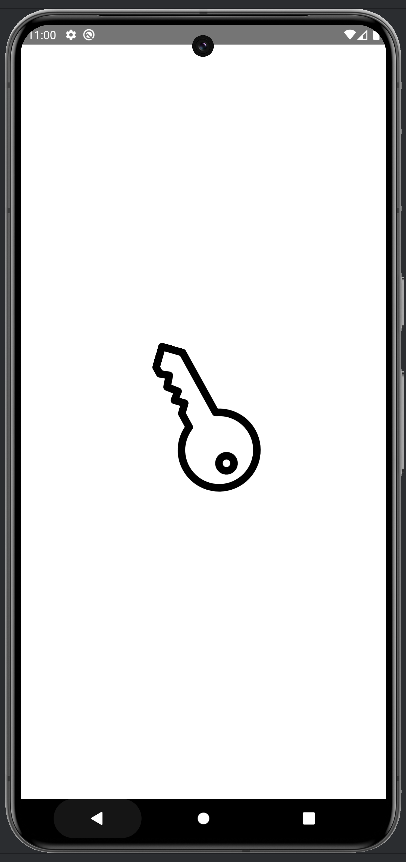
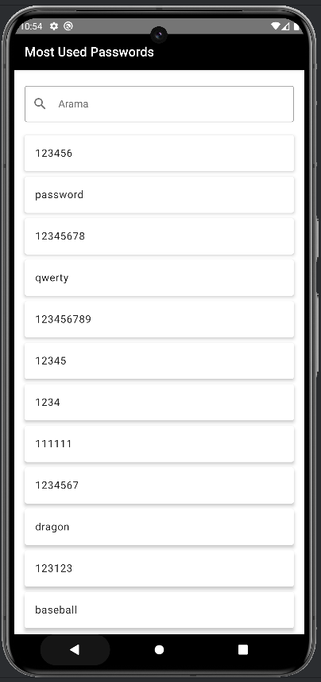

# MostUsedPassword

MostUsedPassword, en çok kullanılan şifrelerin listelendiği ve kullanıcıların güvenli şifreler seçmelerine yardımcı olan basit bir Android uygulamasıdır. Uygulama, MVVM mimarisi ve Clean Architecture prensiplerine uygun olarak geliştirilmiştir. Jetpack Compose kullanılarak modern ve etkileyici bir kullanıcı arayüzü sunulmaktadır.

## 📱 Ekran Görüntüleri

### Splash Screen


### Ana Ekran


## 🚀 Özellikler

- **Güvensiz Şifre Listesi:** En çok kullanılan şifrelerin listelenmesi.
- **Arama Fonksiyonu:** Kullanıcıların şifreler arasında arama yapabilmesi.
- **Animasyonlu Splash Screen:** Uygulama başlatıldığında görsel animasyonlarla hoş bir geçiş.
- **Temiz ve Modern UI:** Jetpack Compose ile oluşturulmuş kullanıcı dostu arayüz.

## 🛠 Kullanılan Teknolojiler

- **Kotlin:** Android geliştirme için modern ve güçlü bir dil.
- **Jetpack Compose:** Deklaratif UI geliştirme.
- **MVVM (Model-View-ViewModel):** Uygulama mimarisi.
- **Clean Architecture:** Kodun modüler, test edilebilir ve sürdürülebilir olmasını sağlayan mimari prensipler.
- **Retrofit:** HTTP istekleri için güçlü bir istemci.
- **OkHttp:** HTTP istemcisi.
- **Coroutines:** Asenkron programlama için Kotlin coroutines.
- **Navigation Compose:** Jetpack Compose ile navigasyon yönetimi.

## 📦 Kurulum

### Ön Koşullar

- Android Studio Bumblebee veya üstü.
- Android SDK 24 veya daha yeni bir sürüm.
- İnternet bağlantısı.

### Adımlar

1. **Depoyu Klonlayın:**
   ```bash
   https://github.com/Kasimcyln/most-used-pass-app.git
